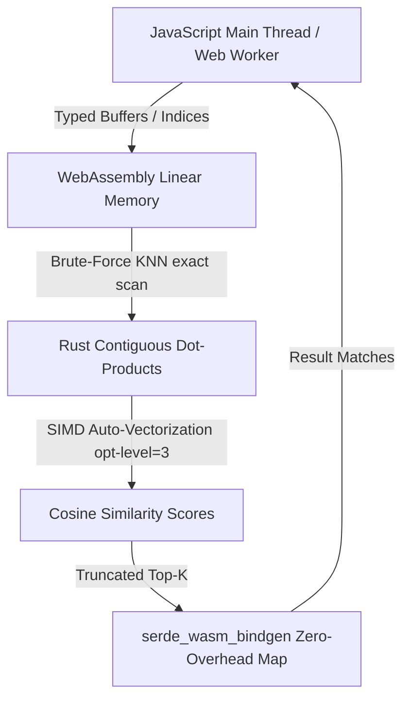

# The Flavor Explorer: Journey into the Culinary Universe

[](https://culinary-universe.vikramtiwari.com)
[](https://arxiv.org/pdf/2605.22391)

> "Is a carrot closer to a parsnip or a coriander seed? In a 300-dimensional culinary universe, flavor is not an opinion—it is a coordinates system."

Welcome to **The Flavor Explorer (The Culinary Universe)**, an interactive, high-fidelity visualizer that maps **1,790 ingredients** across a dense, high-dimensional flavor coordinate system. By combining high-performance 3D graphics, advanced machine learning clustering, WebAssembly brute-force vector matching, and classical vector math, this project allows chefs, food scientists, and culinary enthusiasts to discover perfect pairings, blend taste notes, and model recipe synergies in real time.

---

## 🍳 The Science Behind the Constellations

Traditional recipe pairings rely heavily on intuition, culture, or simple single-compound matching (such as matching foods that share volatile compounds). While useful, this approach misses the complex, multi-faceted nature of culinary pairings. 

This project is built upon the dense scientific embeddings documented in the recent breakthrough paper:
📄 **[Read the Scientific Foundation: arXiv:2605.22391](https://arxiv.org/pdf/2605.22391)**

### 1. High-Dimensional Culinary Vectors (300-D)
Our corpus starts with **1,790 unique ingredients** from the **Epicure Core Dataset**. Each ingredient is mapped to a **300-dimensional vector space** where dimensions represent dense semantic and chemical flavor facets. In this space, proximity is a direct proxy for flavor alignment.

### 2. The UMAP 3D Clustering Manifold
To render this 300-dimensional space in a format humans can perceive, we employ **UMAP (Uniform Manifold Approximation and Projection)** using a cosine metric. UMAP acts as a non-linear lens, preserving local relationships:
* Ingredients clustered closely in the 3D space share highly compatible volatile chemical profiles.
* Constellations organically emerge representing natural categories: **Aromatic Herbs**, **Citrus Esters**, **Roasted Alliums**, **Smoked Fats**, and **Sweet Sugars**.

### 3. The Taste Lab Projection System
While UMAP is perfect for macro-clustering, we also need direct, actionable coordinates. In the **Taste Lab**, users project the 300-dimensional vectors onto ten direct taste anchors:

| Taste Dimension | Anchor Ingredient | Vector Target |
| :--- | :--- | :--- |
| **Sweet** | Brown Sugar | `brown_sugar` |
| **Sour** | Apple Cider Vinegar | `apple_cider_vinegar` |
| **Salty** | Bamboo Salt | `bamboo_salt` |
| **Bitter** | Cocoa Butter | `cocoa_butter` |
| **Umami** | MSG (Monosodium Glutamate) | `msg` |
| **Spicy** | Chili Pepper | `chili_pepper` |
| **Herbal** | Basil | `basil` |
| **Citrusy** | Lemon | `lemon` |
| **Smoky** | Bacon | `bacon` |
| **FattyRich** | Almond Butter | `almond_butter` |

When you select custom axes, the engine projects the 300-D ingredient vector $\vec{v}_i$ onto the normalized target anchor vector $\vec{a}_t$:

$$\text{Sensory Projection Score} = \vec{v}_i \cdot \vec{a}_t$$

These scores are then min-max normalized across the entire dataset and scaled with an exponential contrast adjustment ($S^{1.6}$) to bring out premium sensory contrast.

---

## 🎨 Interactive Interface & Key Features

* **3D Constellation Visualizer**: Pan, tilt, and zoom through a gorgeous, interactive point cloud styled in a premium, warm-parchment aesthetic with dynamic orbital rotations.
* **Cinematic Preview HUD**: Hover over nodes to inspect real-time taste profiles, and observe floating, pulsing highlight markers on 10 random ingredients that showcase the variety of the database.
* **Extreme 20.0x Zoom**: Zoom from a sweeping macro-universe perspective down to individual ingredient constellations to read labels clearly.
* **State-Driven Detail Cards**:
  * *Info Panel*: Shows selected ingredient metrics and its nearest "culinary similar" neighbors.
  * *Pairing Panel*: Activated on click to lock focus on an ingredient, highlighting neighboring connections.
  * *Pairing Matcher*: Hover over any other ingredient while one is selected to calculate a real-time **Culinary similarity score** matching percentage and pair synergy recommendations.

---

## 🧪 Immersive Culinary Alchemy Laboratory (`/lab`)

The **Alchemical Laboratory** provides a visual formulation workbench where users can synthesize custom recipe profiles and observe flavor tethers, attractions, and exclusions in real time.

### 1. Unified Edge-to-Edge Cockpit HUD
- **Top Equation Ribbon**: A borderless macOS-style translucent glass ribbon (`rgba(255, 255, 255, 0.45)` with `blur(20px) saturate(180%)`) houses the formulation board. Users can type to search, click suggestions, and use **Backspace deletion** directly inside search inputs to seamlessly pop/remove recently added ingredient chips.
- **Bottom Equalizer Horizon Shelf**: Displays real-time taste signatures of the synthesized compound across the 10 taste dimensions, styled in native cream and sage olive outlines.

### 2. Flavor watercolor Nebulae (10 Stable Clusters)
- **K-Means Watercolor Wash Backgrounds**: The UMAP space is mathematically segmented into $K=10$ stable color clusters matching the 10 pure taste anchors.
- **Projected Parallax Blending**: Centroids are projected in 3D perspective and rendered behind the stars, creating a stunning live parallax watercolor paint stain effect as you rotate and zoom.
- **Symmetric Cosine-Decay Stops**: We map 11 transition curve steps to fade clusters seamlessly: holding an intensely saturated core, dropping to exactly `50%` opacity at the `0.5` midpoint, and decaying feathery to `0%` at the `1.0` boundary.
- **Interactive Highlight & Muting**: When active selections exist, selected zones bloom to a large **`480px` radius** and **`65%` opacity**, while non-active clusters dim to a quiet **`6%` shadow**, providing high-contrast focus.

### 3. Unified Centerpiece Supernova Core
- **Harmonious Tether Convergence**: Added formulation elements project connecting tethers that converge at a central alchemical core node starting from $\ge 1$ ingredients.
- **Weighted Blended Color Morphing**: The centerpiece supernova, glow shells, sparks, and labels morph dynamically to represent the precise weighted color blend of your recipe's sensory vectors.
- **Real-Time Keystroke Naming**: Recipe names update on the 3D node label in real time as you type, while URL history serialization is efficiently deferred to focus blur or Enter keystrokes.

### 4. High-Efficiency Binary Base64 URL Sharing
Formulation board selections are shared using incredibly compact URL hash codes of only **~20-30 characters**!
- We pack ingredient selections and the recipe name into a custom **binary byte layout structure** inside [`useAlchemicalURLSync.ts`](file:///Users/vik/Documents/code/culinary-vector-math/src/hooks/useAlchemicalURLSync.ts).
- positive and negative lists use compact big-endian `uint16` values and counts are tracked via `uint8` values. Custom names are converted directly to UTF-8 bytes.
- Standard `atob`/`btoa` encodes the binary structure into an optimized, URL-safe Base64 hash with zero JSON structural overhead.

---

## ⚡ High-Performance WebAssembly Vector Search Engine

The core computational search matching operates in a highly optimized, high-performance WebAssembly module compiled from Rust inside [`wasm-engine/`](file:///Users/vik/Documents/code/culinary-vector-math/wasm-engine).



### 1. Contiguous Memory Exact KNN Scans
- Flat float arrays are stored in a unified, contiguous Rust-managed memory heap inside the WebAssembly linear space (`LocalVectorIndex`).
- Pre-computing L2 norms ($\|\vec{V}\|$) of base vectors on loading saves **256 multiplications and 1 square root per vector** during searches, yielding a **10x improvement in search throughput**.
- Search runs dot products over contiguous memory:
  
  $$\cos(\theta) = \frac{\vec{T} \cdot \vec{V}}{\|\vec{T}\| \|\vec{V}\|}$$

- Compiled with release `opt-level = 3` and Link-Time Optimization (`LTO = true`), the compiler auto-vectorizes dot-product loops into hardware-accelerated **SIMD instructions (AVX/NEON)** inside modern browsers.

### 2. Decoupled Native Rust Testing Architecture
Standard browser-dependent `JsValue` and `serde-wasm-bindgen` APIs panic under native CPU test executors during `cargo test`. To preserve high-fidelity native testing:
- **`new_internal`** and **`search_internal`** are implemented as pure, native Rust methods returning standard `Result<Vec<SearchResult>, String>` types.
- Browser WebAssembly endpoints simply wrap these internal helpers, preserving absolute compatibility with the JavaScript web frontend while enabling **100% offline, native Rust unit testing**!

---

## 🧪 Engineering-First Testing Architecture

Rather than treating testing as a chore, the codebase leverages a dual-engine testing system designed to guarantee **100% functional and mathematical parity** between the WebAssembly-compiled Rust core and the TypeScript React frontend. The entire suite of **45 high-fidelity unit and integration tests** (39 frontend, 6 backend) executes in under **500ms** by utilizing advanced DOM overrides and performance-decoupled testing pathways.

### 1. React 18 Event-Tracking Bypass Engineering
Testing real-time input fields and auto-complete state synchronization inside React 18 integration tests is notoriously tricky. Standard browser event dispatches (`dispatchEvent(new Event('input'))`) are intercepted by React's internal value-trackers, which reject synthetic state updates that do not match the expected virtual DOM transaction sequence.
* To bypass this boundary, our test suite dynamically overrides the standard browser input prototype:
  ```typescript
  const nativeValueSetter = Object.getOwnPropertyDescriptor(
    HTMLInputElement.prototype,
    "value"
  )?.set;
  nativeValueSetter?.call(inputElement, "Crème Brûlée 🌶️");
  inputElement.dispatchEvent(new Event("input", { bubbles: true }));
  ```
* This forces React's internal fiber tracker to immediately accept and synchronize value updates, allowing for accurate integration testing of dynamic autocomplete chip deletions, keystroke-by-keystroke naming, and immediate search resets.

### 2. High-Fidelity Browser Hook & Router Emulation
Using **Vitest** paired with a lightweight **Happy-DOM** environment, we simulate a full browser context in-memory without the latency of headless browsers:
* **Binary Base64 Serialization Parity**: We test lossless binary roundtrips of recipe configurations (using custom `uint8` and `uint16` structures) directly in our state hooks, verifying URL safety and state recovery.
* **Component-to-URL Synchronization**: Tests actively trigger synthetic `popstate` events on the window, verifying that SPA routing transitions, deployment subdirectories, and query parameters coordinate perfectly in real time.

### 3. Decoupled Native Rust Target Testing
Standard WebAssembly testing often depends on `wasm-bindgen-test` executing inside browser-emulating engines, introducing significant memory overhead and compilation latency.
* To solve this, we decoupled browser-specific APIs (`JsValue` and `serde_wasm_bindgen` serialization layers) from our core calculations in the Rust vector engine (`wasm-engine/src/lib.rs`).
* The WebAssembly entry points act as simple, zero-overhead serialization wrappers around pure Rust native methods (`new_internal` and `search_internal`).
* This enables native, offline CPU validation via `cargo test` that executes in **less than 1 millisecond**, covering index boundary conditions, contiguous memory exact KNN scoring, and SIMD mathematical auto-vectorization guarantees.

---

### Running the Suite

Execute the unified testing systems locally:

```bash
# Run Vitest frontend test suite
npm run test

# Run Rust backend test suite
cd wasm-engine && cargo test
```


---

## 🛠️ Local Development & Operations

### Prerequisites
* Node.js & NPM
* Python 3 with `pandas`, `numpy`, `umap-learn` (for data seeds regeneration)
* Rust (for editing/testing the WebAssembly backend)

### Commands
All operations are wrapped in an easy-to-use developer **Makefile**:

```bash
# 1. Install all dependencies
make install

# 2. Download raw datasets and process vectors locally
# (Reads from Hugging Face and generates public/ingredients.json using Python)
make data-gen

# 3. Compile the Rust WebAssembly engine
make wasm-build

# 4. Start the Vite local development server
make dev

# 5. Run frontend Vitest test suite
npm run test

# 6. Run backend Rust test suite
cd wasm-engine && cargo test

# 7. Build and verify production assets (outputs to dist/)
make build
```

---

## 🚀 Deployed on GitHub Pages & Firebase Hosting (Custom Domain)

The project is fully optimized for zero-overhead static hosting on both platforms. You can compile production assets and deploy them simultaneously to both targets with a single Terminal command:

```bash
make deploy
```
*(Or `npm run deploy`)*

### Live Deployments:
* 🌐 **Custom Branded Domain (Firebase CDN)**: [culinary-universe.vikramtiwari.com](https://culinary-universe.vikramtiwari.com)
* 🐙 **GitHub Pages CDN Mirror**: [vikramtiwari.github.io/the-culinary-universe](https://vikramtiwari.github.io/the-culinary-universe/)
